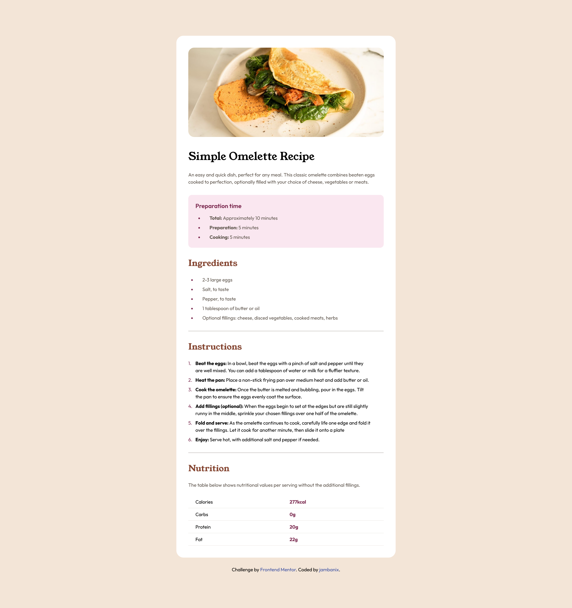

# Frontend Mentor - Recipe page solution

This is a solution to the [Recipe page challenge on Frontend Mentor](https://www.frontendmentor.io/challenges/recipe-page-KiTsR8QQKm). Frontend Mentor challenges help you improve your coding skills by building realistic projects. 

## Table of contents

- [Overview](#overview)
  - [The challenge](#the-challenge)
  - [Screenshot](#screenshot)
  - [Links](#links)
- [My process](#my-process)
  - [Built with](#built-with)
  - [What I learned](#what-i-learned)
  - [Continued development](#continued-development)
- [Author](#author)

**Note: Delete this note and update the table of contents based on what sections you keep.**

## Overview

### Screenshot

### Links

- Solution URL: [Here](https://github.com/jambanix/frontendmentor_recipe-page)
- Live Site URL: [Here](https://jambanix.github.io/frontendmentor_recipe-page/)

## My process

### Built with

- HTML5
- CSS
- Flexbox
- Mobile-first workflow

### What I learned

For this attempt I went for the approach of making common CSS classes and applying them to elements to avoid repetitive code.

### Continued development

I will continue to code the CSS this way to make things more efficient

## Author

- Frontend Mentor - [@jambanix](https://www.frontendmentor.io/profile/jambanix)

